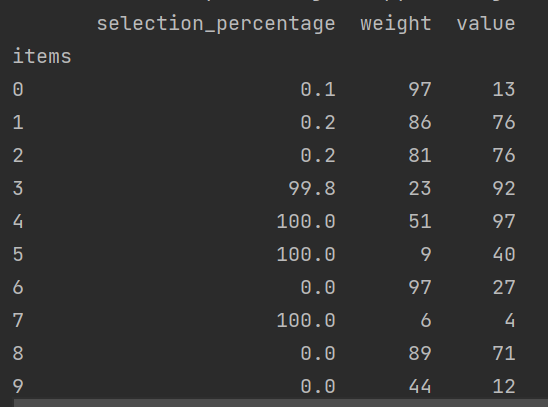

# Genetic Algorithm – Knapsack Problem

This project demonstrates how a genetic algorithm can be used to solve the classic 0/1 knapsack problem in Python. It simulates natural selection to find combinations of items that maximize value without exceeding a weight limit.

## 🧠 Problem Description

You are given a list of items, each with a weight and a value. The goal is to select a subset of these items such that:
- The **total value** is as high as possible.
- The **total weight** does not exceed the limit (in this case: 200 units).

## ⚙️ How it works

- Each solution (individual) is represented as a binary genome (list of `True`/`False`).
- A population of such individuals is evolved over multiple generations using:
  - **Fitness evaluation** – total value if under weight limit, otherwise 0.
  - **Selection** – keeps the best individuals.
  - **Crossover** – combines parts of two parents.
  - **Mutation** – randomly flips a bit with low probability.

## 🧪 Sample Output

The script outputs a table like this:

Where `selection_percentage` shows how often an item was selected in the population at the end of evolution.

This is a simplified, educational implementation – not optimized for performance.
